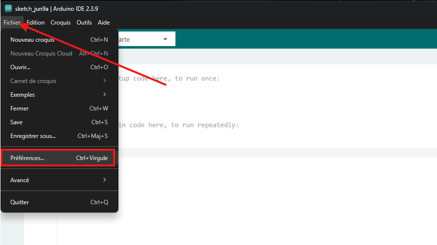
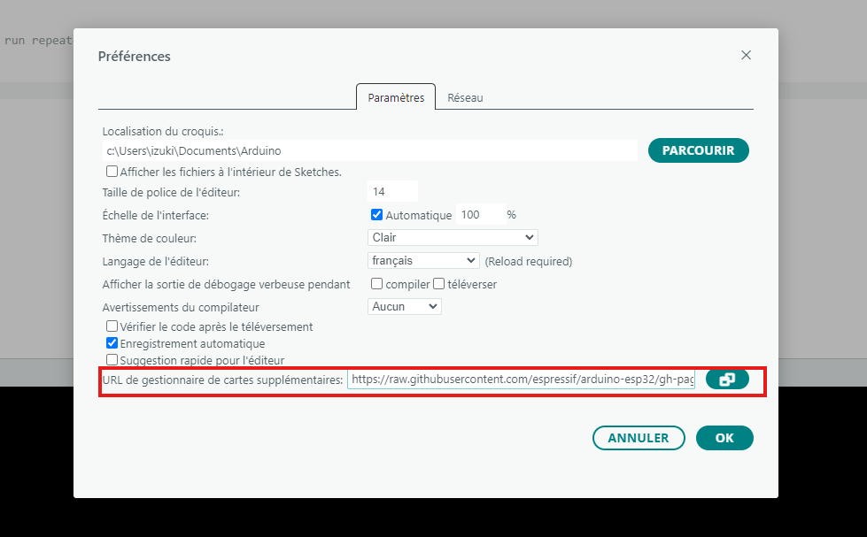
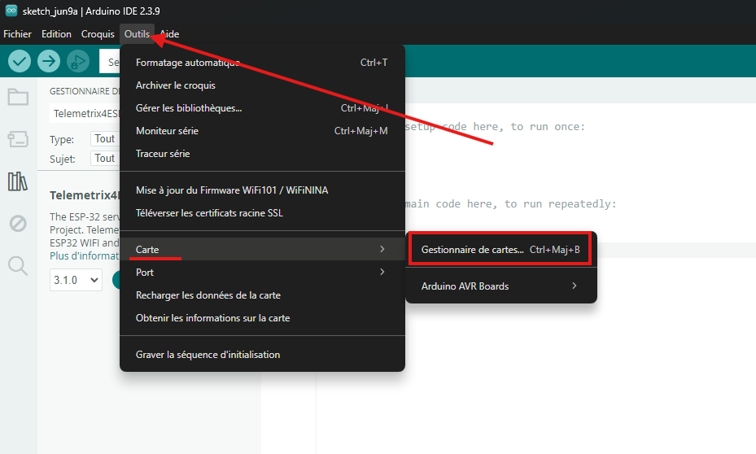
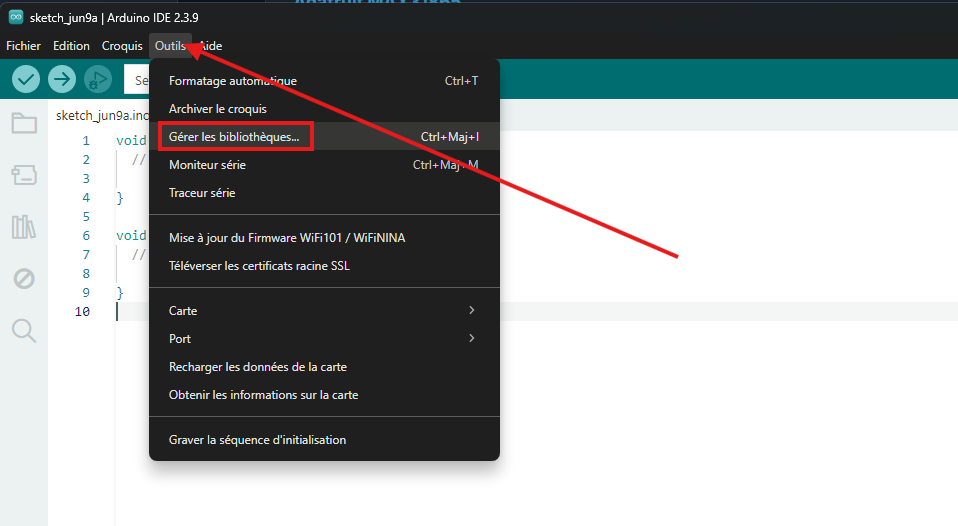
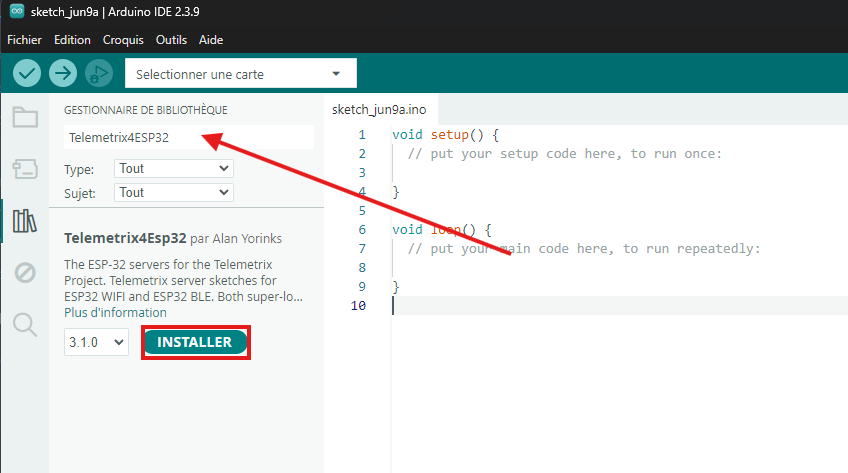
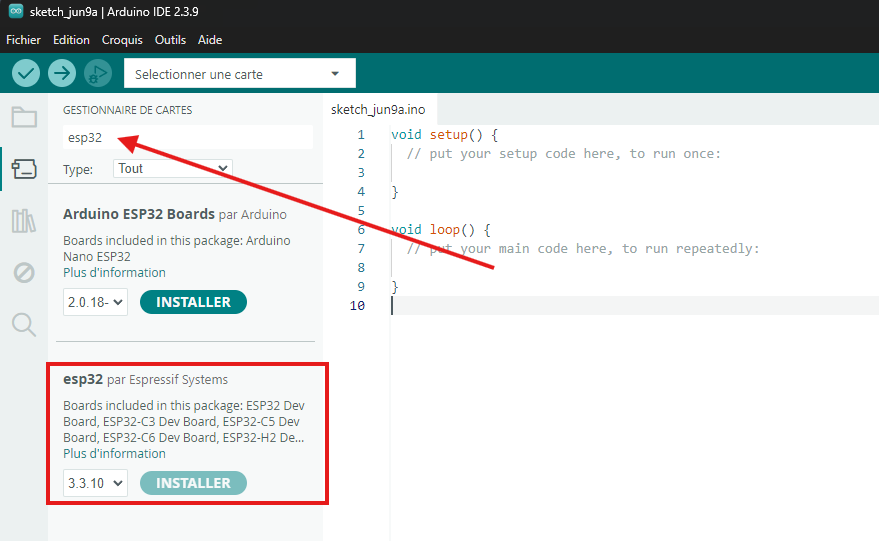
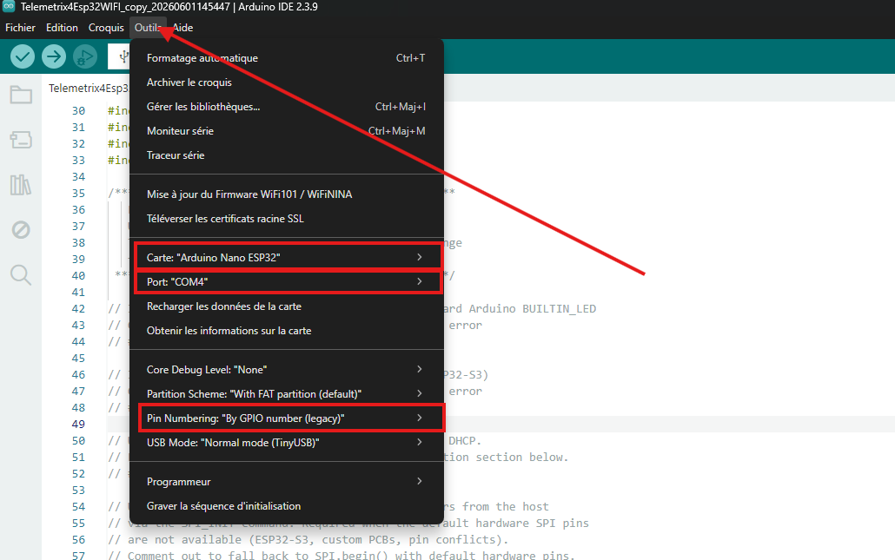
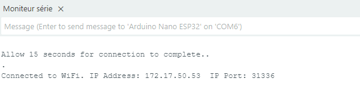

Flashing the Telemetrix firmware
================================

This guide describes how to prepare the Arduino IDE, install the required libraries and
flash the **Telemetrix4ESP32WIFI** firmware on the Arduino Nano ESP32.

.. note::

   Adapted from the official Telemetrix-ESP32 documentation by Alan Yorinks (MrYsLab) —
   `mryslab.github.io/telemetrix-esp32 <https://mryslab.github.io/telemetrix-esp32>`_ —
   to the DAP project and the Arduino Nano ESP32.

Principle
---------

Telemetrix follows a **client / server** model:

* **the firmware (server)** — a fixed C++ sketch flashed *once* on the ESP32. It waits for
  commands over WiFi and returns data to the client;
* **the Python client** — the PyMoDAQ plugin, which sends commands and receives data. No
  firmware change is needed to change the behaviour.

Communication goes over **WiFi (TCP/IP)** on port **31336**. The ESP32 and the computer
must be on the **same local network**.

1. Install the Arduino IDE
--------------------------

The Arduino IDE is required to compile and upload the firmware. Download the latest version
from the `official Arduino website <https://www.arduino.cc/en/software>`_ for your
operating system. You also need a **USB-C cable** to connect the Arduino Nano ESP32.

2. Add the ESP32 core
---------------------

The Arduino IDE does not support the ESP32 natively; add the core through the boards
manager.

#. Open *File → Preferences*.
#. In *Additional boards manager URLs*, paste:

   .. code-block:: text

      https://raw.githubusercontent.com/espressif/arduino-esp32/gh-pages/package_esp32_index.json

#. Open *Tools → Board → Boards Manager*, search for ``esp32`` and install
   *esp32 by Espressif Systems*.

   Adding the ESP32 boards-manager URL in the Preferences.

   Installing the *esp32 by Espressif Systems* package.

.. warning::

   The project uses the ESP32 core **version 3.3.7**. Check the installed version in the
   boards manager — a different version may break compatibility with the Telemetrix
   firmware.

3. Install the firmware
-----------------------

Download the ``Telemetrix4Esp32WIFI`` firmware file (right-click → *Save link as*), then
double-click it to open it directly in the Arduino IDE.

   The firmware sketch opened in the Arduino IDE.

Install the required libraries from *Tools → Manage Libraries* (search ``Telemetrix4Esp32``
and install its dependencies when prompted).

   Installing the Telemetrix library and its dependencies.

   Accept the installation of the dependencies.

.. warning::

   The downloaded file is a **modified** version of the official firmware. Do **not**
   install it through the Library Manager — use the downloaded file only.

4. Configure the sketch
-----------------------

At the top of the file are the *feature flags* and the WiFi credentials. Set the SSID and
password of the local network:

.. code-block:: cpp

   const char *ssid     = "NETWORK_NAME";
   const char *password = "PASSWORD";

Check the feature flags as described in the sketch header, then compile.

   Checking the feature flags before compiling.

   Selecting the board / port and uploading the firmware.

5. Get the board IP address
---------------------------

After upload, open the **Serial Monitor**: the ESP32 prints the IP address it obtained on
the network. Note it down — it is the address you will enter in the PyMoDAQ plugins.

   The ESP32 prints its IP address in the Serial Monitor.
