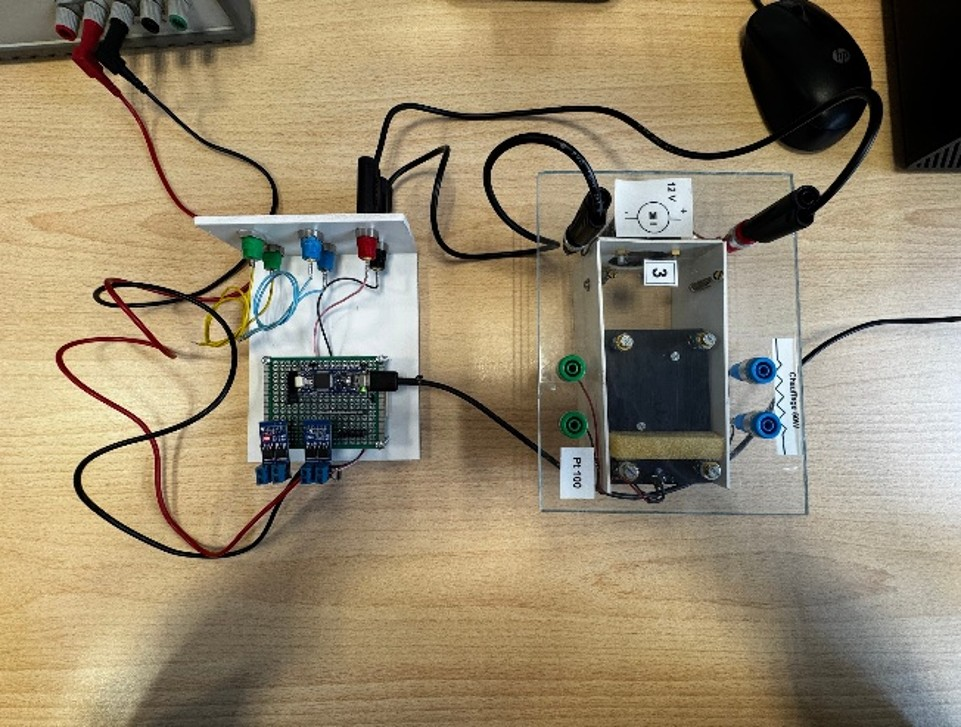
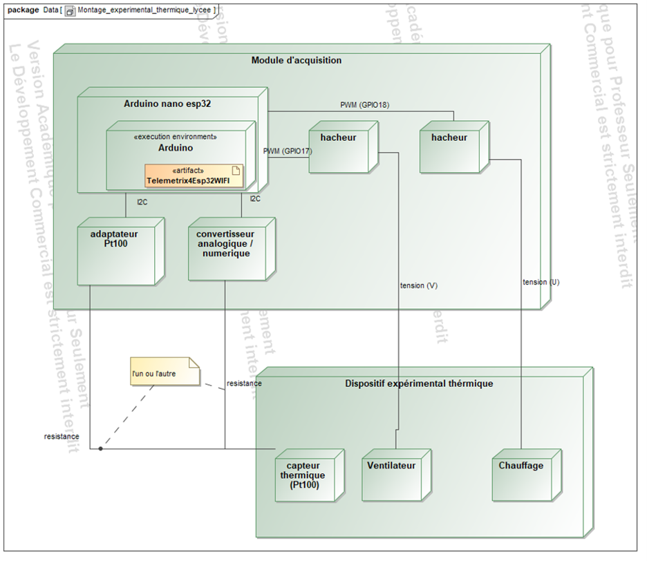
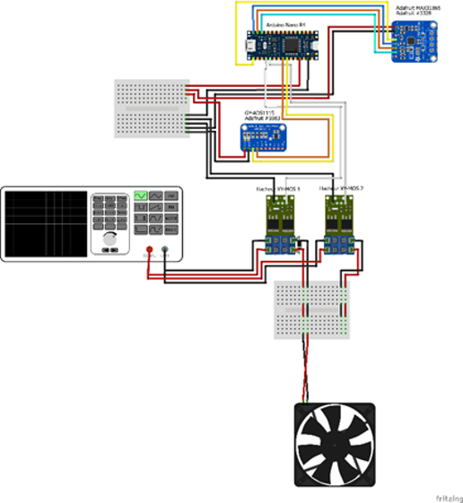

Experimental setup
==================

This page describes the thermal test bench driven by an **Arduino Nano ESP32** through the
Telemetrix WiFi firmware. The goal is to drive a fan and a heater and to read the
temperature from a PT100 probe, remotely from PyMoDAQ, without changing the firmware for
each new use case.

   The Arduino Nano ESP32 thermal test bench.

Hardware
--------

The setup is built around the following components:

* **Arduino Nano ESP32** — main controller running at 3.3 V. It runs the Telemetrix
  firmware and communicates with PyMoDAQ over **WiFi (TCP/IP)**.
* **2 × XY-MOS choppers** — MOSFET boards that modulate the power sent to the fan and to
  the heater through a PWM signal.
* **MAX31865 module** — dedicated converter to read the PT100 probe; it communicates with
  the ESP32 over **SPI** in 3.3 V logic.
* **Fan** — cools the device, driven in PWM on GPIO17.
* **PT100 probe** — platinum resistance whose value varies with temperature (≈ 100 Ω at
  0 °C), chosen for its precision and reliability in laboratory applications.

System architecture
-------------------

The architecture follows a **client / server** model over WiFi.

   Components diagram.

**Supervision (the computer)** runs a Python virtual environment hosting PyMoDAQ:

* ``DAQ_Move_FanHeater`` — sends the PWM set-points (0–100 %) to the fan and the heater
  through Telemetrix;
* ``DAQ_0DViewer`` (PT100 / MAX31865) — receives and displays the measured temperature;
* the ``telemetrix_aio_esp32`` library — handles the asynchronous WiFi communication with
  the ESP32.

**Hardware control (the Arduino Nano ESP32)** runs the ``Telemetrix4ESP32WIFI`` firmware,
which opens a TCP server on the local network (port **31336** by default). It receives the
commands from the Python client and returns the acquired data:

* PWM outputs: GPIO17 (fan) and GPIO18 (heater), through the XY-MOS choppers;
* SPI interface: reading of the MAX31865 module to acquire the PT100 temperature.

Wiring
------

   Wiring diagram of the Arduino setup.

**MAX31865 module (SPI)**

============  ====================
Signal        Arduino Nano ESP32
============  ====================
CLK           D13 (GPIO13)
SDO / MISO    D12 (GPIO12)
SDI / MOSI    D11 (GPIO11)
CS            D10 (GPIO10)
VIN           3.3 V
GND           GND
============  ====================

**XY-MOS choppers (PWM)**

* Heater → GPIO18 (D9) — command from 0 to 100 %
* Fan → GPIO17 (D8) — command from 0 to 100 %

.. warning::

   Telemetrix ESP32 uses the **GPIO numbers**, not the labels printed on the board.
