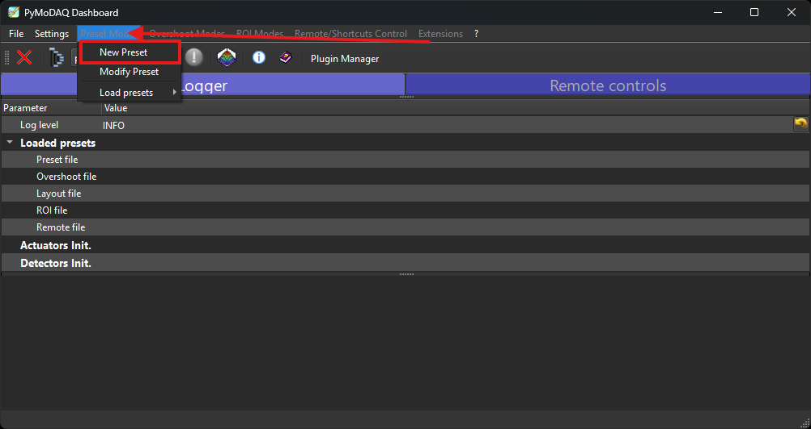
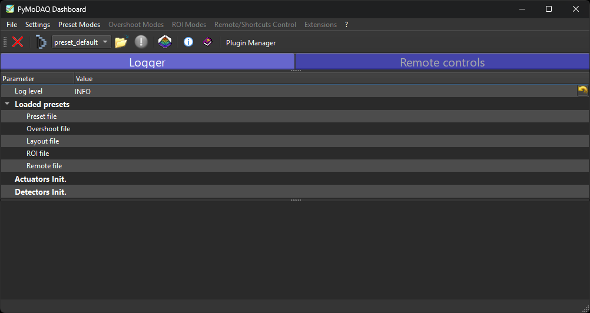

Using the plugin
================

This page explains how to launch PyMoDAQ, build a preset for the Arduino plugin, drive the
fan and the heater, and acquire the temperature from the PT100 probe.

1. Launch the PyMoDAQ Dashboard
-------------------------------

.. note::

   Make sure the Arduino Nano ESP32 is **powered on and connected to the WiFi** before
   launching PyMoDAQ.

Activate your environment, then launch the Dashboard:

.. code-block:: bash

   conda activate pymodaq_env
   dashboard

2. Create or load a preset
--------------------------

On start-up, the Dashboard asks you to create or load a **preset** — a configuration file
listing the modules used for your device.

   Creating a preset for the Arduino bench.

To create a new preset:

#. Click *Preset Mode*, then *New preset*, and give it a name (e.g. ``arduino_tp``).
#. Add a ``DAQ_Move`` module and select the **FanHeater** plugin. Enter the **IP address**
   of the Arduino controller. This first module becomes the **Master** (check its
   *Controller ID*).
#. Add a ``DAQ_Viewer`` module and select the plugin matching your sensor:

   * **MAX31865** — for a PT100 probe (resistive, high precision);
   * **ADS1115** — for an analog temperature sensor through a 16-bit ADC.

   Enter the **same IP address** and the **same Controller ID** as the ``DAQ_Move``; this
   module is then a **Slave**.
#. Save the preset.

.. important::

   Only **one** module can be the **Master**. All other modules sharing the same
   controller must be **Slave**, and all of them must use the **same IP address** and the
   **same Controller ID**.

To reuse an existing preset, click *Load preset* and select the ``.xml`` file.

3. Drive the fan and the heater
-------------------------------

Once the preset is loaded, the ``DAQ_Move`` **FanHeater** module exposes two axes:

* **Heater axis (Master)** — drives the heater from 0 % to 100 %; this axis initialises the
  connection with the ESP32;
* **Fan axis (Slave)** — drives the fan from 0 % to 100 %, sharing the connection opened by
  the Master.

Enter the set-point in percent in the matching axis field (e.g. ``75``) and press *Enter*
or click *Move*. The plugin automatically converts the value to a PWM signal (0–255) and
sends it to the ESP32 through Telemetrix.

   The Dashboard with the FanHeater actuator and the temperature viewer.

4. Acquire the temperature
--------------------------

Start a grab on the ``DAQ_Viewer`` module: it reads the PT100 (through the MAX31865) or the
analog sensor (through the ADS1115) and displays the temperature in real time, ready to be
logged or plotted against the fan / heater set-points.
